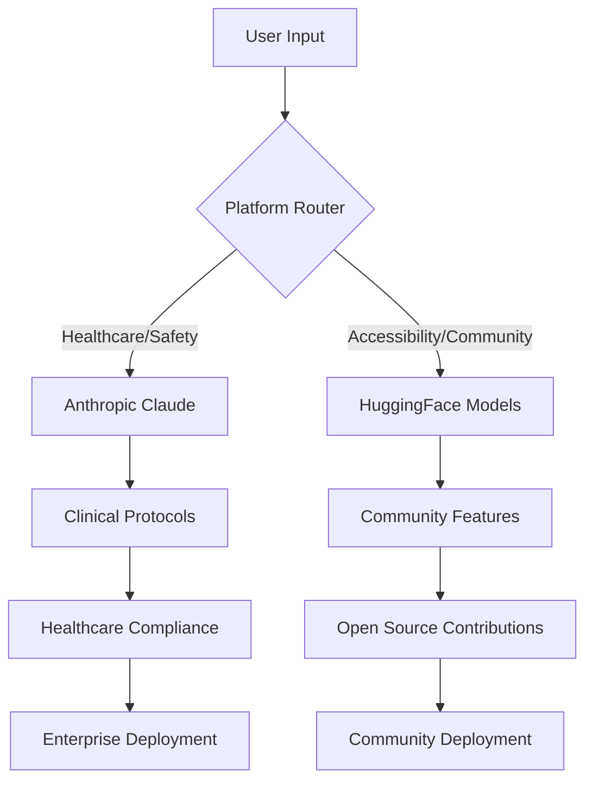

# Christman AI Partnership Roadmap
## Strategic Integration Plans for Anthropic and Hugging Face

*Maximizing Each Partnership's Strengths Across the 7-Platform Ecosystem*

---

## 🎯 Partnership Strategy Overview

### **Core Principle: Complementary Strengths**
Rather than competing partnerships, we envision **complementary integration** where each company powers the platforms best suited to their expertise and mission alignment.

### **Anthropic Focus: Healthcare & Safety**
**Constitutional AI excels at high-stakes, vulnerable population applications**
- 💢 **Inferno AI** (PTSD/trauma recovery)
- 🐺 **AlphaWolf** (dementia care)
- 🔒 **Aegis AI** (child protection)
- 🕊️ **OmegaAlpha** (senior safety)

### **Hugging Face Focus: Accessibility & Community**
**Open source democratization excels at broader accessibility applications**
- 🗣️ **AlphaVox** (AAC communication)
- ♿ **Omega** (mobility assistance)
- 🏡 **AlphaDen** (adaptive learning)

---

## 🏥 Anthropic Partnership: Healthcare Leadership

### **Platform Assignments**

#### **💢 Inferno AI (Primary Focus)**
**Claude Integration for Trauma-Informed Care**
- **Model**: Fine-tuned Claude for trauma protocols
- **Safety**: Constitutional AI for crisis intervention
- **Compliance**: HIPAA-ready clinical deployment
- **Revenue**: Healthcare enterprise licensing
- **Timeline**: 6 months to full Claude integration

#### **🐺 AlphaWolf (Cognitive Care)**
**Constitutional AI for Vulnerable Seniors**
- **Model**: Claude adapted for memory support
- **Safety**: Prevent wandering, medication errors
- **Compliance**: Healthcare privacy protection
- **Revenue**: Medicare/insurance partnerships
- **Timeline**: Q3 2026 launch with Claude

#### **🔒 Aegis AI (Child Protection)**
**Ultimate Harm Reduction Application**
- **Model**: Claude for safety monitoring
- **Safety**: Constitutional principles prevent false positives
- **Compliance**: Child protection legal frameworks
- **Revenue**: School district licensing
- **Timeline**: Q4 2026 pilot programs

#### **🕊️ OmegaAlpha (Senior Safety)**
**Constitutional AI for Dignity in Aging**
- **Model**: Claude for companionship + safety
- **Safety**: Fall detection, emergency response
- **Compliance**: Elder care regulations
- **Revenue**: Senior living facility partnerships
- **Timeline**: Q2 2027 market entry

### **Technical Architecture**
```yaml
Anthropic Integration:
  Models:
    - claude-3-trauma-informed
    - claude-3-cognitive-care
    - claude-3-child-safety
    - claude-3-senior-companionship
  
  Deployment:
    - Healthcare cloud infrastructure
    - HIPAA-compliant hosting
    - Clinical audit logging
    - Regulatory compliance monitoring
  
  Safety Features:
    - Constitutional AI safeguards
    - Crisis intervention protocols
    - Harm reduction optimization
    - Vulnerable population protection
```

### **Business Model**
- **Enterprise Healthcare**: $100-500/month per healthcare provider
- **Insurance Partnerships**: Medicare/Medicaid coverage
- **Institutional Licensing**: Hospitals, VA, senior care
- **Revenue Split**: 70% Christman AI, 30% Anthropic
- **Projected ARR**: $25M by Year 3

---

## 🌍 Hugging Face Partnership: Accessibility Democratization

### **Platform Assignments**

#### **🗣️ AlphaVox (Primary Focus)**
**Open Source AAC Revolution**
- **Models**: Community-developed speech models
- **Distribution**: HF Hub for global access
- **Customization**: Fine-tuning for individual needs
- **Revenue**: Premium features, hardware partnerships
- **Timeline**: Q1 2026 open source launch

#### **♿ Omega (Mobility Intelligence)**
**Democratized Accessibility AI**
- **Models**: Vision + navigation on HF Hub
- **Distribution**: Edge deployment for devices
- **Customization**: Adaptive to individual disabilities
- **Revenue**: Hardware manufacturer licensing
- **Timeline**: Q2 2026 beta release

#### **🏡 AlphaDen (Adaptive Learning)**
**Open Educational AI**
- **Models**: Learning adaptation algorithms
- **Distribution**: Educational institution access
- **Customization**: Cultural and linguistic adaptation
- **Revenue**: School licensing, premium content
- **Timeline**: Q3 2026 pilot programs

### **Technical Architecture**
```yaml
HuggingFace Integration:
  Models:
    - accessibility/speech-to-symbol
    - accessibility/navigation-assist
    - accessibility/adaptive-learning
    - accessibility/motor-control
  
  Distribution:
    - HF Hub hosting
    - Transformers library integration
    - Edge deployment optimization
    - Community contribution framework
  
  Community Features:
    - Disability-led development
    - Open source training data
    - Collaborative model improvement
    - Accessibility-first documentation
```

### **Business Model**
- **Freemium Open Source**: Basic models free, premium features paid
- **Hardware Partnerships**: Revenue from device manufacturers
- **Educational Licensing**: Schools and institutions
- **Revenue Split**: 80% Christman AI, 20% Hugging Face
- **Projected ARR**: $15M by Year 3

---

## 🔄 Cross-Platform Synergies

### **Shared Infrastructure**
- **Data Pipeline**: Both partnerships share anonymized insights
- **Security**: Same encryption/privacy standards across all platforms
- **User Experience**: Consistent design language across ecosystem
- **Clinical Validation**: Joint research studies for all healthcare applications

### **Technical Integration Points**


### **Data Sharing Framework**
- **Privacy-First**: No personal data sharing between partnerships
- **Research Insights**: Aggregated, anonymized research data
- **Model Improvement**: Cross-learning for better outcomes
- **Compliance**: Separate HIPAA/GDPR handling per partnership

---

## 📊 Competitive Advantages

### **For Anthropic**
- ✅ **Healthcare Market Leadership**: First major AI company with clinical-grade trauma AI
- ✅ **Constitutional AI Validation**: Proving harm reduction works in real healthcare
- ✅ **Regulatory Relationships**: VA, FDA, healthcare systems trust
- ✅ **Revenue Growth**: $25M ARR from healthcare verticals

### **For Hugging Face**
- ✅ **Accessibility Market Leadership**: First major platform for disability-led AI
- ✅ **Community Impact**: Real democratization for marginalized populations
- ✅ **Open Source Innovation**: New models for accessibility applications
- ✅ **Global Reach**: Multilingual, culturally adaptive platforms

### **For Christman AI**
- ✅ **Best of Both Worlds**: Enterprise healthcare + open source accessibility
- ✅ **Risk Mitigation**: Not dependent on single AI provider
- ✅ **Market Dominance**: Leadership across all disability AI verticals
- ✅ **Sustainable Growth**: $40M combined ARR by Year 3

---

## 🗓️ Implementation Timeline

### **Phase 1: Foundation (Q1 2026)**
**Anthropic:**
- Inferno AI Claude integration complete
- Clinical validation study launch
- HIPAA compliance certification

**Hugging Face:**
- AlphaVox models on HF Hub
- Community development program launch
- Open source governance framework

### **Phase 2: Expansion (Q2-Q3 2026)**
**Anthropic:**
- AlphaWolf development begins
- VA hospital pilot programs
- Healthcare enterprise sales

**Hugging Face:**
- Omega mobility models release
- Educational partnerships for AlphaDen
- International accessibility outreach

### **Phase 3: Scale (Q4 2026 - 2027)**
**Anthropic:**
- Aegis AI child protection launch
- OmegaAlpha senior care deployment
- Regulatory approval pathways

**Hugging Face:**
- Full ecosystem open source components
- Global community of disability developers
- Hardware manufacturer partnerships

---

## 💰 Financial Projections

### **Combined Ecosystem Revenue (3-Year)**

| Platform | Year 1 | Year 2 | Year 3 | Primary Partner |
|----------|--------|--------|--------|-----------------|
| Inferno AI | $2.4M | $8.5M | $15M | Anthropic |
| AlphaVox | $1.2M | $4.2M | $8M | Hugging Face |
| AlphaWolf | - | $2.8M | $7M | Anthropic |
| Omega | - | $1.8M | $4M | Hugging Face |
| AlphaDen | - | $1.5M | $3M | Hugging Face |
| Aegis AI | - | - | $2M | Anthropic |
| OmegaAlpha | - | - | $1M | Anthropic |
| **Total** | **$3.6M** | **$18.8M** | **$40M** | - |

### **Investment Requirements**
- **Anthropic Partnership**: $3M (clinical validation, compliance, enterprise sales)
- **Hugging Face Partnership**: $2M (model development, community building, open source)
- **Total Investment Needed**: $5M Series A

---

## 🎯 Success Metrics

### **Healthcare Impact (Anthropic)**
- **100K+ users** across trauma and cognitive care platforms
- **Clinical outcomes**: 30% improvement in mental health scores
- **Healthcare partnerships**: 50+ VA hospitals, 200+ healthcare systems
- **Regulatory approval**: FDA clearance for medical device classification

### **Accessibility Impact (Hugging Face)**
- **1M+ downloads** of accessibility models from HF Hub
- **10K+ developers** contributing to disability AI development
- **Global reach**: 50+ languages, 100+ countries
- **Community growth**: Largest disability-led AI development platform

### **Combined Ecosystem**
- **10M+ total users** across all 7 platforms
- **$40M ARR** by Year 3
- **Research impact**: 20+ peer-reviewed publications
- **Social impact**: Measurable improvement in disability community outcomes

---

## 🤝 Call to Action

### **For Both Partners**
This isn't just a business opportunity—**it's a chance to prove AI can save lives and democratize dignity.**

### **Next Steps**
1. **Joint Partnership Meeting**: Anthropic + HuggingFace + Christman AI
2. **Technical Architecture Review**: Integration planning for both partnerships
3. **Legal Framework**: Partnership agreements that complement rather than compete
4. **Pilot Program Launch**: 90-day proof-of-concept across key platforms

### **The Vision**
**By 2027: The Christman AI ecosystem becomes the gold standard for ethical AI deployment in healthcare and accessibility, powered by the best of both Constitutional AI and open source democratization.**

---

*"How can we help you love yourself more?"*

**This is how we answer that question at scale. Together.** 🚀

---

## 📞 **Contact & Next Steps**

**Everett Christman**  
Founder & CEO, The Christman AI Project  
**Email:** lumacognify@thechristmanaiproject.com  
**Website:** https://thechristmanaiproject.com

**Ready for:**
- Technical deep-dive presentations
- Due diligence material sharing
- Partnership term discussions
- Pilot program planning

*The future of AI is trauma-informed, accessible, and built with Constitutional principles. Let's build it together.*